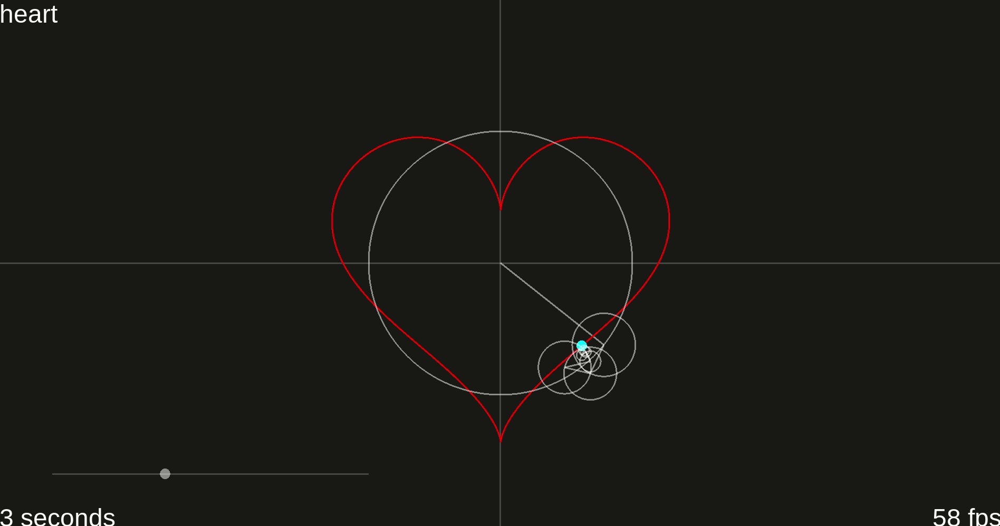

## Animating the Complex Fourier Series

### About

This is yet another simple, interactive application for visualizing the Complex Fourier Series. It's built on Python, Pyglet, SciPy, and NumPy and should run on any modern operating system. In the demo below, the red curve represents a complex-valued parametric function, and each each rotating line segment represents a term in the corresponding Complex Fourier Series. This application allows us to visualize, in real-time, how these complex-valued functions which take intricate paths can be broken down into the sum of vectors which each rotate at their own constant rate.

### Install Dependencies

Steps:
- install Python 3.7
- run `pip install -r requirements.txt`

### Quickstart

Steps:
- run `python source/main.py`

See the `docs` folder for instructions on how to use/configure the application
